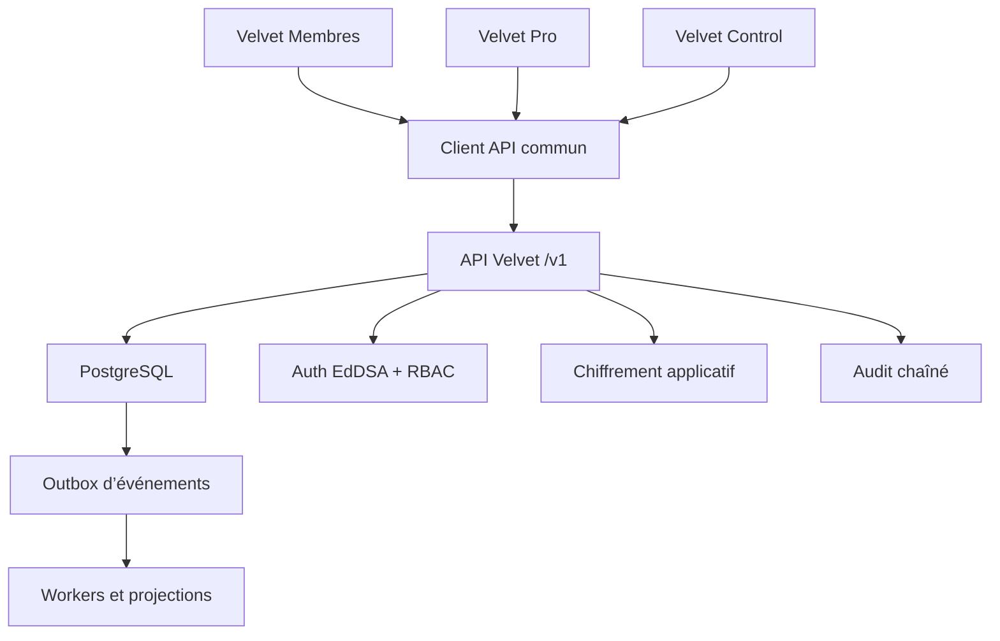

# Velvet — architecture d’industrialisation

## Statut

Ce dossier inaugure le socle technique réel. Il ne remplace pas les interfaces V1 verrouillées : il fournit la source de vérité et les contrats auxquels Velvet Membres, Velvet Pro et Velvet Control vont progressivement se connecter.

## Choix structurants

- Node.js 24 LTS pour l’API.
- PostgreSQL 18 pour la source de vérité transactionnelle.
- API REST versionnée sous `/v1`.
- Client partagé `@velvet/api-client`.
- Événements transactionnels via une table outbox.
- Déploiement portable par conteneurs.
- Données et services hébergeables dans l’Union européenne.

## Vue d’ensemble

## Source de vérité unique

Un utilisateur, un établissement, un événement ou une inscription ne doit être créé qu’une seule fois.

- Velvet Membres lit et écrit les profils, sorties et inscriptions.
- Velvet Pro gère les établissements et publie des événements.
- Velvet Control consulte les mêmes entités, leurs droits et leur chronologie.
- L’outbox enregistre les changements à propager sans créer de double écriture.

## Identité et sessions

- Adresse email normalisée et unique.
- Mot de passe dérivé avec scrypt, sel aléatoire et pepper externe à la base.
- Jeton d’accès EdDSA de 15 minutes.
- Refresh token opaque de 30 jours, stocké uniquement sous forme de hash.
- Rotation obligatoire à chaque renouvellement.
- Cookie HttpOnly, `SameSite=Strict` et `Secure` en environnement non local.
- Audience distincte : `members`, `pro` ou `control`.

Un jeton émis pour Velvet Membres ne peut donc pas ouvrir Velvet Control.

## Autorisations

Le RBAC initial comprend :

- `member`
- `pro_owner`
- `pro_staff`
- `organizer`
- `moderator`
- `support`
- `auditor`
- `admin`
- `direction`

Les autorisations sensibles sont contrôlées sur le serveur. L’interface ne constitue jamais une barrière de sécurité.

## Chiffrement

- TLS obligatoire en production.
- AES-256-GCM pour les champs privés ou très sensibles.
- Donnée chiffrée associée à son contexte, par exemple `member_profile:<user_id>`.
- Identifiant de clé conservé dans l’enveloppe pour permettre la rotation.
- Clés injectées par secret manager, jamais stockées dans Git.

## Audit

Le journal `audit_events` est :

- append-only ;
- protégé contre les mises à jour et suppressions ;
- chaîné par hash HMAC ;
- lié à l’acteur, la requête, l’entité et l’action.

Il ne remplace pas une solution de conservation externe immuable. Une réplication WORM sera ajoutée lors du déploiement de production.

## Interconnexion

Chaque mutation métier importante écrit, dans la même transaction :

1. la donnée métier ;
2. l’événement d’audit ;
3. l’événement outbox.

Cette approche empêche qu’une donnée soit modifiée sans que les autres applications puissent être informées.

## Démarrage local

1. Copier `.env.example` vers `.env`.
2. Générer des secrets : `npm run secrets:dev`.
3. Reporter les valeurs générées dans `.env`.
4. Lancer PostgreSQL : `docker compose up -d postgres`.
5. Installer : `npm install`.
6. Appliquer la migration : `npm run db:migrate`.
7. Démarrer l’API : `npm run dev:api`.
8. Vérifier `GET http://localhost:8080/health`.

## Ordre d’intégration

1. Authentification et onboarding Velvet Membres.
2. Profils et couples.
3. Établissements et collaborateurs Velvet Pro.
4. Événements et inscriptions partagés.
5. Audit et vues Control.
6. Médias, conversations, paiements et notifications.

Cet ordre respecte les dépendances : aucun module aval ne doit inventer sa propre identité ou sa propre copie des données.
