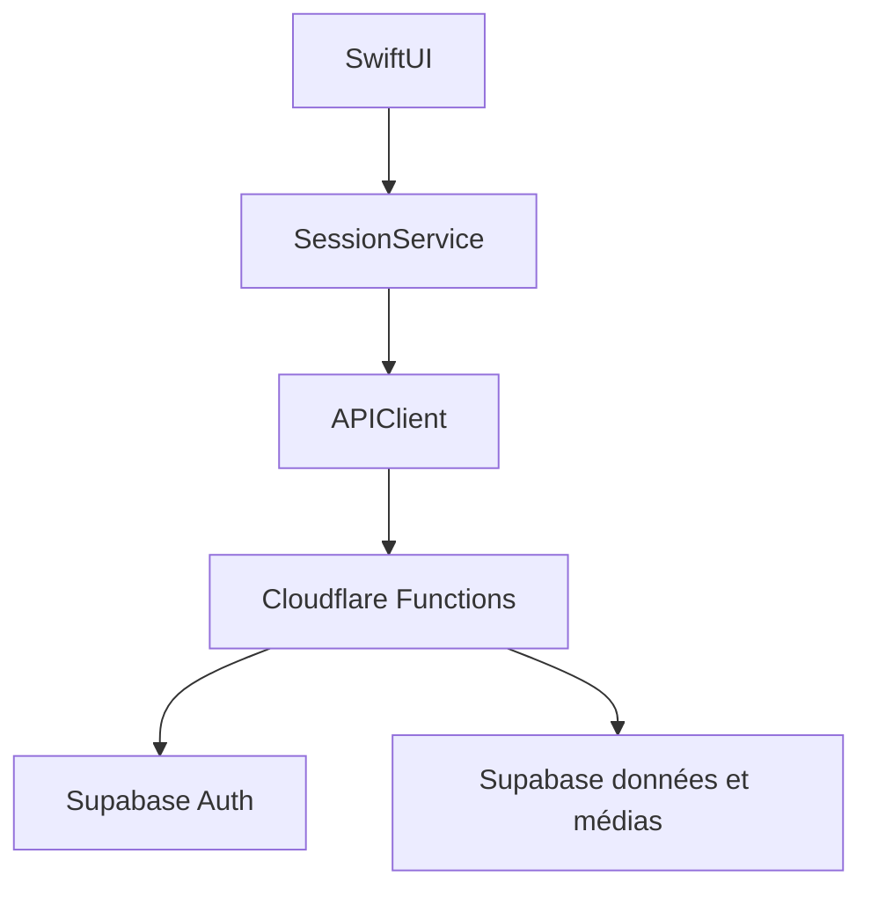

# Architecture native Velvet

## Principe

Le site et l’app iOS partagent les API `/api/auth`, `/api/members` et `/api/billing`. Une évolution du backend est donc visible dans les deux clients dès qu’ils consomment le même contrat. Une évolution d’interface SwiftUI nécessite une nouvelle version TestFlight/App Store.

## Flux

- `AppState` gère les phases : connexion, consentements, onboarding, admission et app.
- `SessionService` porte les contrats réseau et reste sans règle métier inventée.
- `VelvetStore` charge l’annuaire, les notifications et les conversations.
- `ImageCompressor` transforme localement les sélections Photos en JPEG inférieur à la limite serveur.
- `LocationService`, `NotificationService` et `StoreKitService` isolent les API Apple.

## Vie privée

- la session reste un cookie `HttpOnly`, `Secure`, `SameSite=Strict` géré par `URLSession` ;
- aucune clé Supabase ni clé de service n’est embarquée ;
- la position exacte est transmise uniquement après action et consentement, puis arrondie côté serveur ;
- les documents d’identité sont gérés par un prestataire externe ;
- blocage et signalement sont appliqués côté backend ;
- les écrans verrouillés respectent l’état d’admission serveur.

## Limites volontaires

- la recherche actuelle filtre localement les 100 profils renvoyés par l’annuaire ; une recherche paginée serveur sera nécessaire à plus grande échelle ;
- la messagerie recharge par ouverture ou geste de rafraîchissement ; le temps réel pourra utiliser un contrat WebSocket/Supabase Realtime ultérieur ;
- APNs et StoreKit 2 sont préparés mais ne doivent pas être activés sans contrats serveur et produits App Store Connect validés ;
- l’app iOS ne publie pas d’albums privés explicites dans cette tranche.
